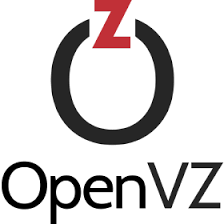

<!DOCTYPE html>
<html lang="en">
<head>
    <meta charset="UTF-8">
    <meta http-equiv="X-UA-Compatible" content="IE=edge">
    <meta name="viewport" content="width=device-width, initial-scale=1.0">
    <meta name="description" content="Stütz Erik's GitHub profile - DevOps, Developer, PhP, Python, React, Linux, VMs">
    <meta name="keywords" content="DevOps, Developer, PhP, Python, React, Linux, VMs">
    <meta name="author" content="Stütz Erik">
    <meta name="robots" content="index, follow">
    <meta name="revisit-after" content="1 Week">
    <meta name="distribution" content="local">
    <meta name="rating" content="general">
    <link rel="stylesheet" href="https://cdn.jsdelivr.net/npm/bootstrap@4.0.0/dist/css/bootstrap.min.css">

</head>
<body>
    <h1 align="center">Hello, I'm Erik. 🙌</h1>
    

       <i>Thank you for visiting my site. Allow me to introduce myself briefly.</i> 
       I'm a DevOps operations and web development guy. My specialization is creating web interfaces for IT infrastructure providers (IaaS) to manage their services -        developing cloud hosting platforms. For this reason, I place great emphasis on network security and virtualization technologies in addition to development.
     

    <h2>Technologies used by me</h2>
    
I use these technologies during development. If I claim to know a technology, I don't just know the basics, I've studied and used it in depth.

    

        
        
        
        
        
        
        
        
        
    

</body>
</html>
